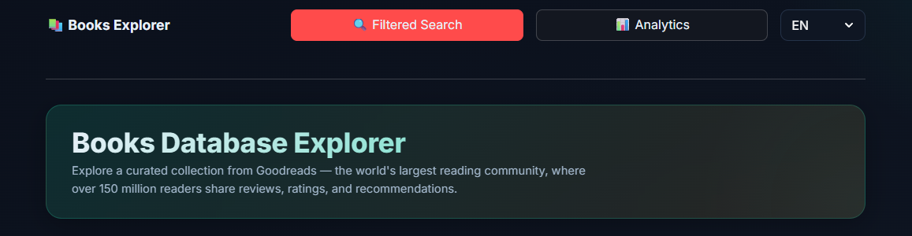

<div align="center">

# 📚 Books Database Explorer

A Streamlit-based book data explorer built on a curated Goodreads subset, with interactive search, analytics, and Google Books enrichment.

English | [简体中文](README.zh-CN.md)

</div>

<p align="center">
  
</p>
Beyond local data, it integrates the Google Books API to enrich book information, making it easy to preview books and access related links. The interface is clean and modern, very easy to start with, and suitable for both quick browsing and deeper analysis.

## Quick Start

### Install

```bash
pip install streamlit pandas requests
```

### Launch

```bash
streamlit run app.py
```

Then open the URL shown in terminal (usually `http://localhost:8501`).

## Features

- Filtered search by title, publish year, rating, and language
- Interactive row selection with richer book details from Google Books API
- Analytics dashboard with trend and distribution charts
- Quick external links to Goodreads, Douban, and StoryGraph
- Clean product-style interface for fast browsing and deeper analysis

## Usage Overview

On the filtered search page, combine publish year, rating, and language filters to narrow down large result sets quickly.

Select a row to fetch richer details from the Google Books API, including cover, publisher, publish date, categories, ISBN, and description.

## Data Source

This project uses the Kaggle dataset **“Goodreads-books”**.

- Source: <https://www.kaggle.com/datasets/jealousleopard/goodreadsbooks>
- Maintainer: `soumik`
- License: [CC0 1.0 (Public Domain Dedication)](https://creativecommons.org/publicdomain/zero/1.0/)
- Source page label: `CC0: Public Domain` (accessed on `2026-03-12`)

This project uses a cleaned subset of the original dataset.
