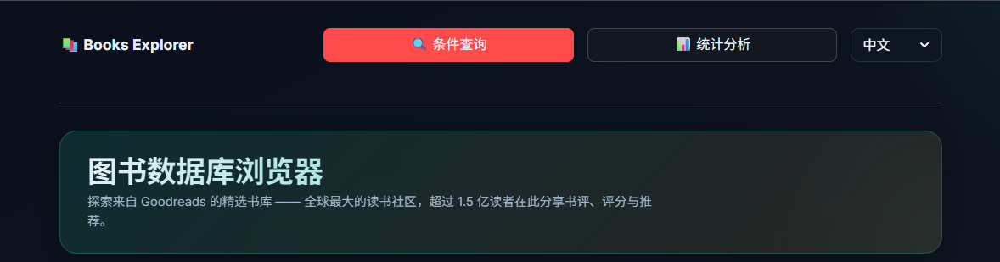

<div align="center">

# 📚 图书数据库浏览器

一个基于 Streamlit 的图书数据探索工具，使用清洗后的 Goodreads 子集，支持交互检索、统计分析与 Google Books 信息增强。

[English](README.md) | 简体中文

</div>

<p align="center">
  
</p>
不止于本地，浏览器还集成了 Google Books API 来丰富书籍信息，能够快速预览书籍内容和相关链接。界面设计简洁现代，上手极其简单，适合快速浏览和深入分析。
## 快速开始

### 安装依赖

```bash
pip install streamlit pandas requests
```

### 启动应用

```bash
streamlit run app.py
```

然后在浏览器打开终端给出的地址（通常是 `http://localhost:8501`）。

## 功能介绍

- 支持按书名、出版年份、评分、语言组合过滤
- 支持在结果表中交互选中书籍并查看详情
- 集成 Google Books API 获取更丰富的书籍信息
- 提供 Goodreads、豆瓣、StoryGraph 快捷链接
- 提供可视化分析页面，用于查看分布与趋势

## 使用说明

在条件查询页面中，你可以通过出版年份、评分和语言进行组合筛选，快速缩小书籍范围。

选中目标书籍后，系统会调用 Google Books API，展示封面、出版社、出版日期、分类、ISBN 与简介等信息。

## 数据来源

本项目数据来源于 Kaggle 数据集 **“Goodreads-books”**。

- 来源：<https://www.kaggle.com/datasets/jealousleopard/goodreadsbooks>
- 维护者：`soumik`
- 许可证：[CC0 1.0（Public Domain Dedication）](https://creativecommons.org/publicdomain/zero/1.0/)
- 数据页标注：`CC0: Public Domain`（访问日期：`2026-03-12`）

本项目使用的是原始数据的清洗子集。
